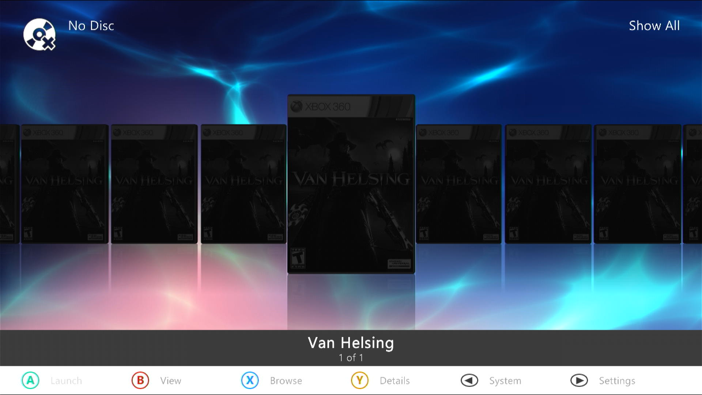
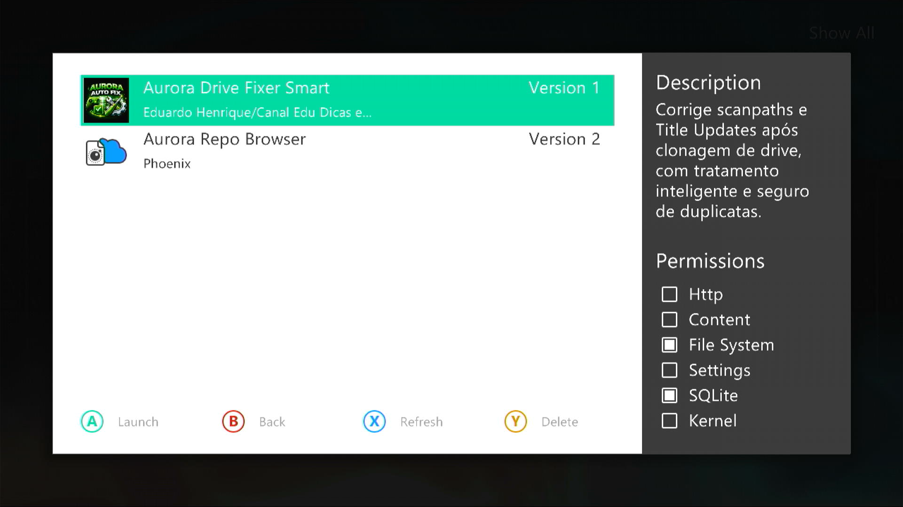
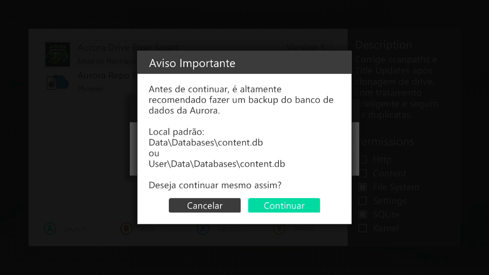
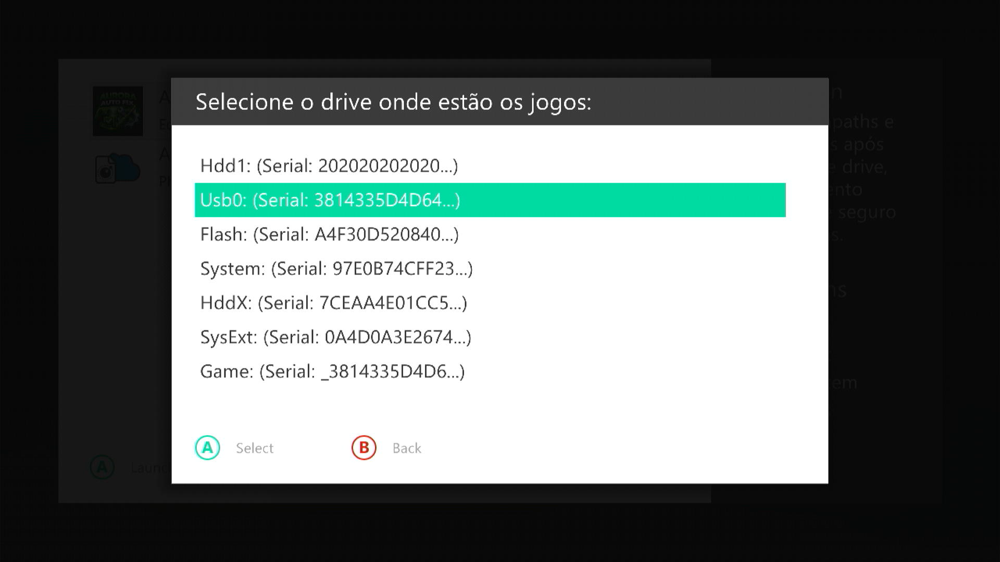
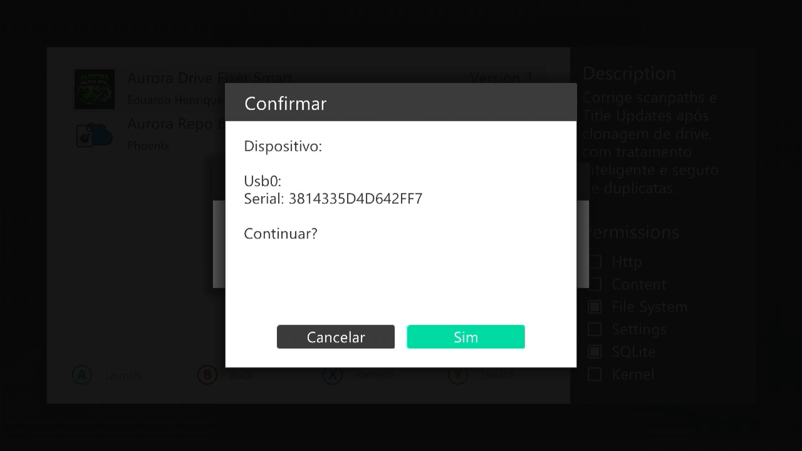
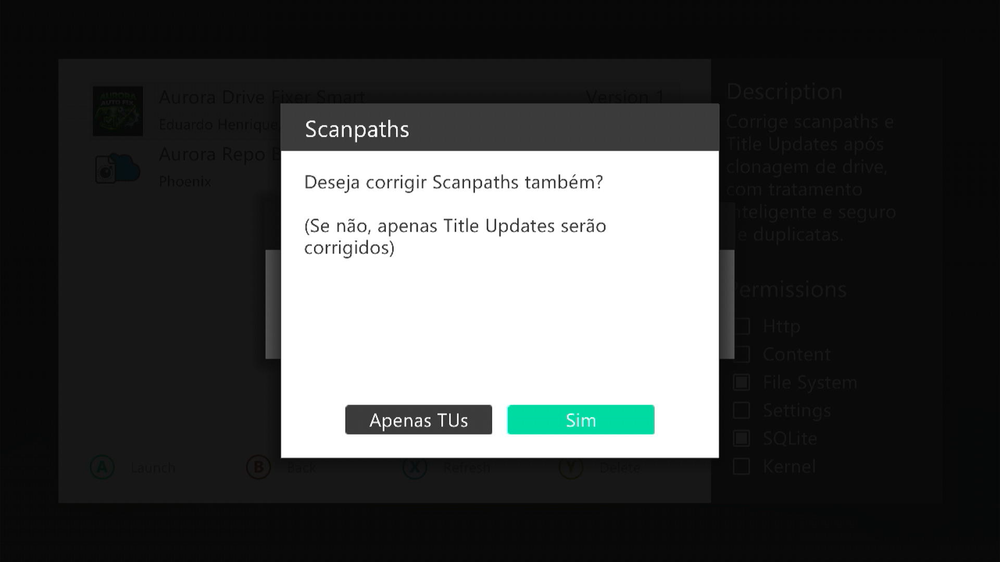
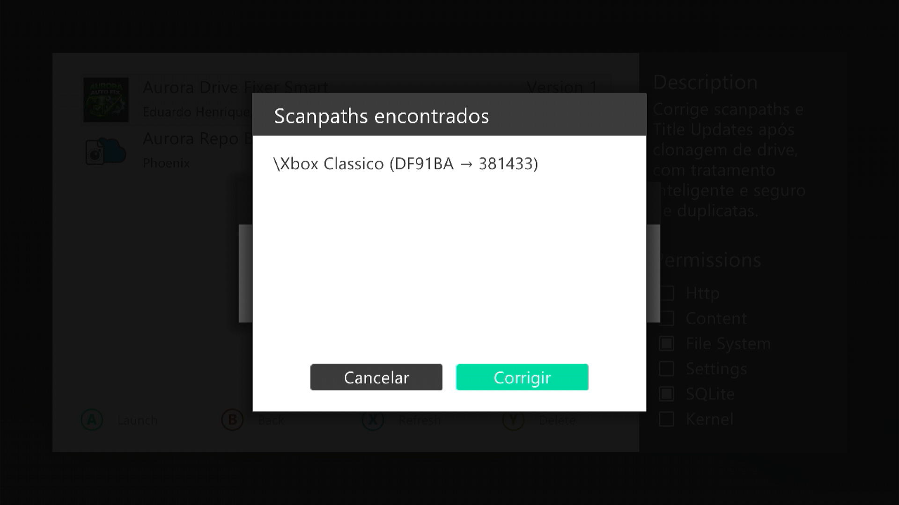
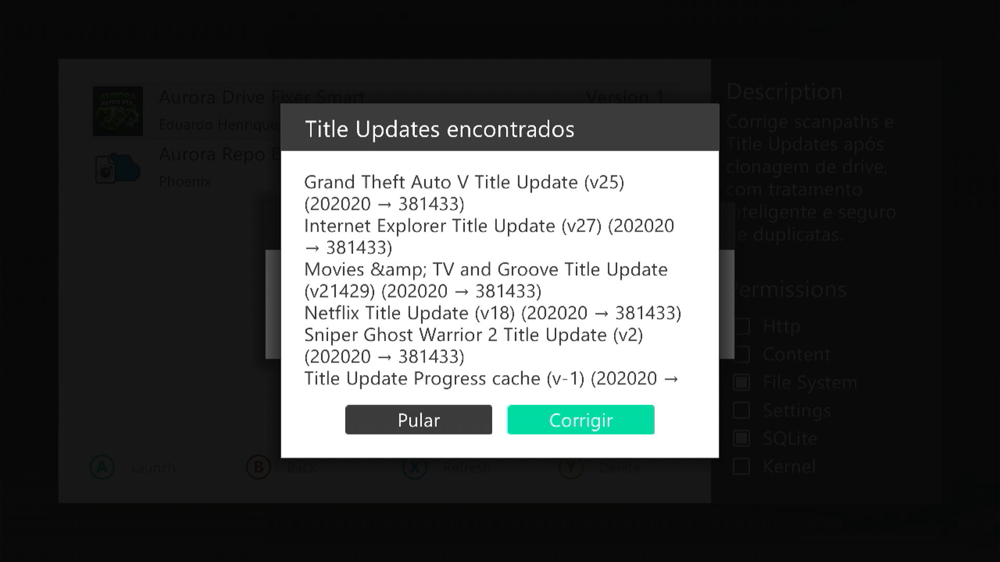
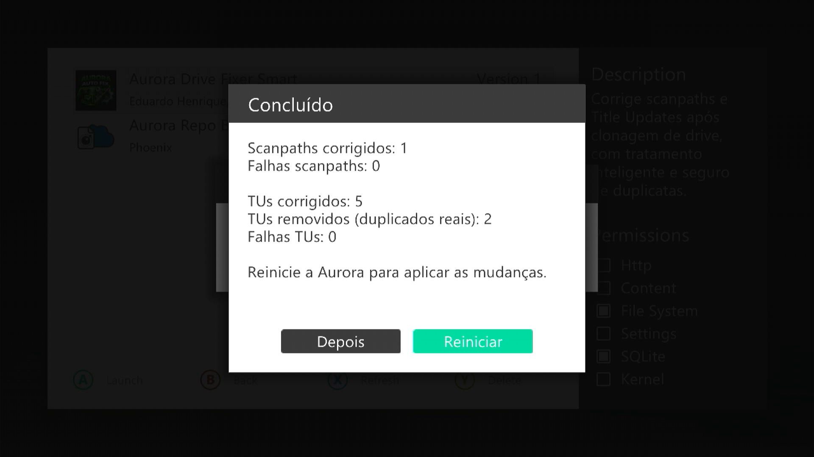
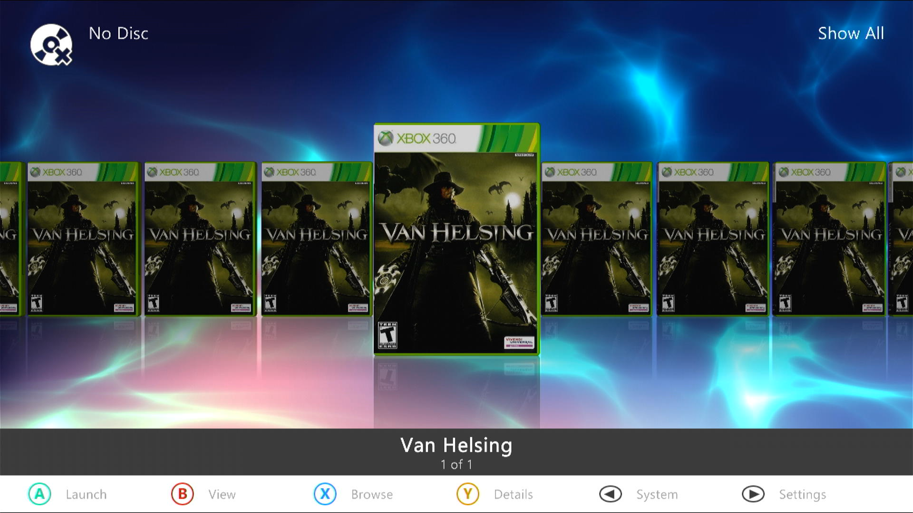

# 🚀 Aurora Drive Fixer Smart

Ferramenta inteligente para corrigir inconsistências no Aurora após troca ou clonagem de dispositivos.

---

## 📌 Sobre

O **Aurora Drive Fixer Smart** foi desenvolvido para corrigir automaticamente problemas comuns causados por clonagem ou troca de HD/USB no Aurora, como:

* Jogos que não aparecem
* Capas acinzentadas (grayed-out)
* Title Updates que não funcionam

A ferramenta atua diretamente no banco de dados do Aurora, ajustando referências internas de forma segura e controlada.

---

## 🖼️ Preview

### Scanpaths com erro
<p align="center">
  
</p>

### Escolha do script
<p align="center">
  
</p>

### Aviso de backup
<p align="center">
  
</p>

### Escolha do drive (serial correto)
<p align="center">
  
</p>

### Confirmação do drive selecionado
<p align="center">
  
</p>

### Escolha entre corrigir Scanpaths e/ou Title Updates
<p align="center">
  
</p>

### Scanpaths encontrados
<p align="center">
  
</p>

### Title Updates encontrados
<p align="center">
  
</p>

### Resultado final (resumo das alterações)
<p align="center">
  
</p>

### Scanpaths corrigidos (sem erro)
<p align="center">
  
</p>
---

## 🧠 Principais Funcionalidades

* 🔧 Correção automática de **Scan Paths**
* 🔄 Ajuste de **Title Updates (TUs)**
* 🧬 **Detecção e remoção de duplicatas reais** de TUs
* 🔍 Identificação de dispositivo por **Serial**
* 👁️ Pré-visualização das alterações antes da aplicação
* 📊 Relatório final com:

  * Itens corrigidos
  * Falhas
  * Duplicatas removidas

---

## 🛡️ Segurança

* ✔️ Nenhuma alteração é feita sem confirmação do usuário
* ✔️ Uso de tratamento de erro (`pcall`) para evitar falhas críticas
* ✔️ Verificação antes de aplicar alterações
* ⚠️ Recomendação explícita de backup antes da execução

> ⚠️ **Importante:**
> O script **não cria backup automaticamente**.
> É altamente recomendado que você faça um backup manual do banco de dados antes de utilizar.

---

## 📦 Quando usar

Utilize esta ferramenta nos seguintes cenários:

* 🔁 Após **clonagem de HD ou pendrive**
* 💾 Após **troca de dispositivo de armazenamento**
* 🎮 Quando jogos **não aparecem na Aurora**
* ⚙️ Quando **Title Updates não são aplicados**

---

## 📂 Backup (Recomendado)

Antes de executar o script, faça backup do arquivo:

```
Data\Databases\content.db
```

ou

```
User\Data\Databases\content.db
```

---

## ⚙️ Como funciona

1. Você seleciona o dispositivo correto (baseado no serial)
2. O script identifica inconsistências no banco
3. Exibe uma prévia das alterações
4. Aplica as correções com segurança
5. Exibe um resumo final

---

## 🔄 Recomendação

Após a execução, **reinicie a Aurora** para garantir que todas as alterações sejam aplicadas corretamente.

---

## 🙏 Créditos

Este projeto foi inspirado no script **Aurora Cloned Drive Fixer**, desenvolvido por EmiMods.

A proposta deste script evolui a ideia original, trazendo:

* Maior automação
* Tratamento inteligente de dados
* Remoção de duplicatas

🔗 Projeto original: [https://github.com/EmiMods/FixClonedDrive](https://github.com/EmiMods/FixClonedDrive)
👤 Autor: EmiMods

---

## ⚠️ Aviso

Use esta ferramenta apenas quando necessário.

Alterações diretas no banco de dados podem causar inconsistências se utilizadas de forma incorreta ou fora do cenário adequado.

---

## 📌 Status

🟢 Estável — pronto para uso

---

## 💬 Contribuição

Sugestões, melhorias e feedback são bem-vindos!