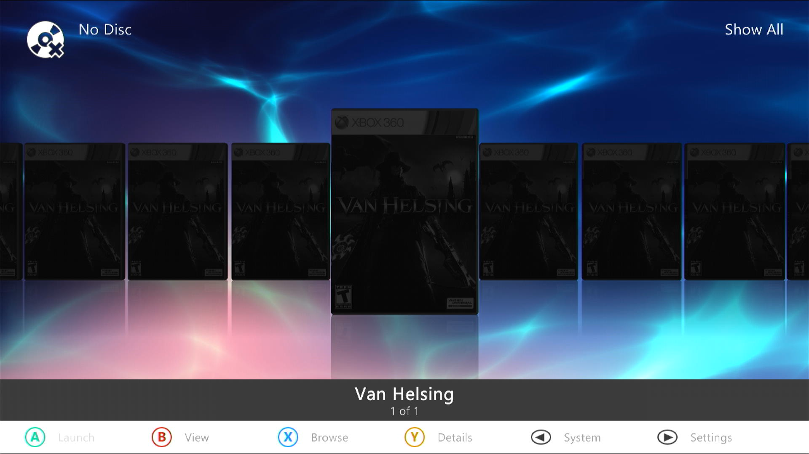
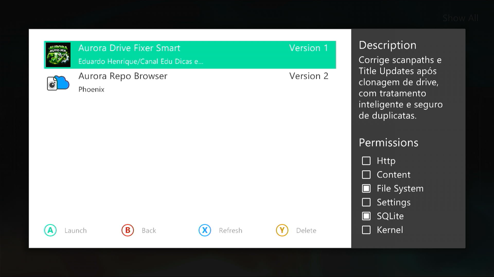
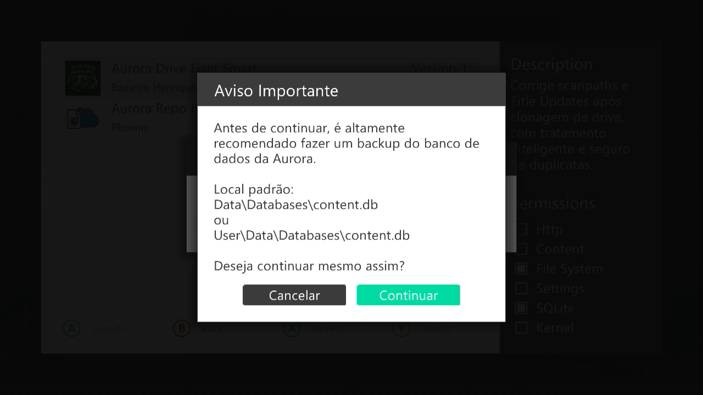
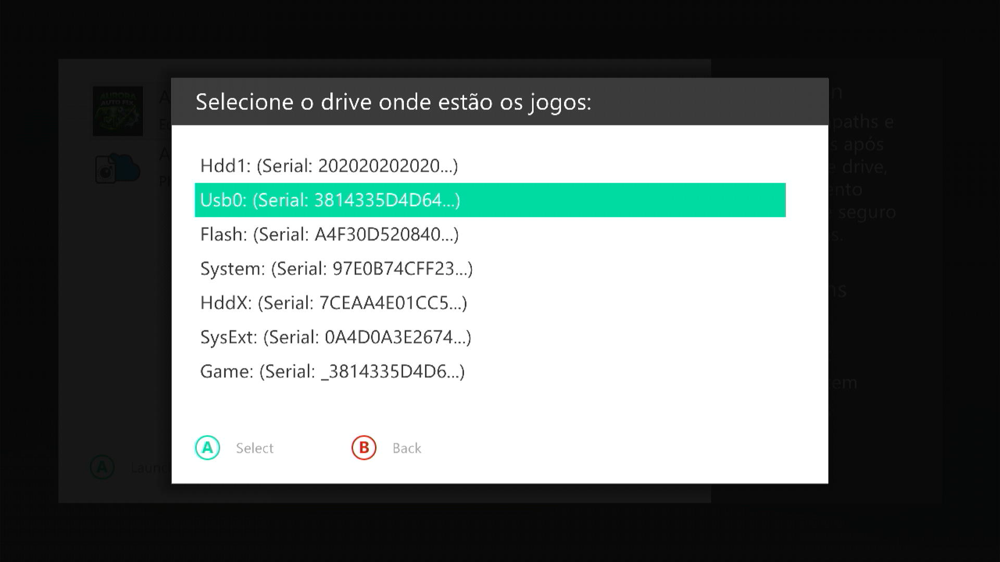
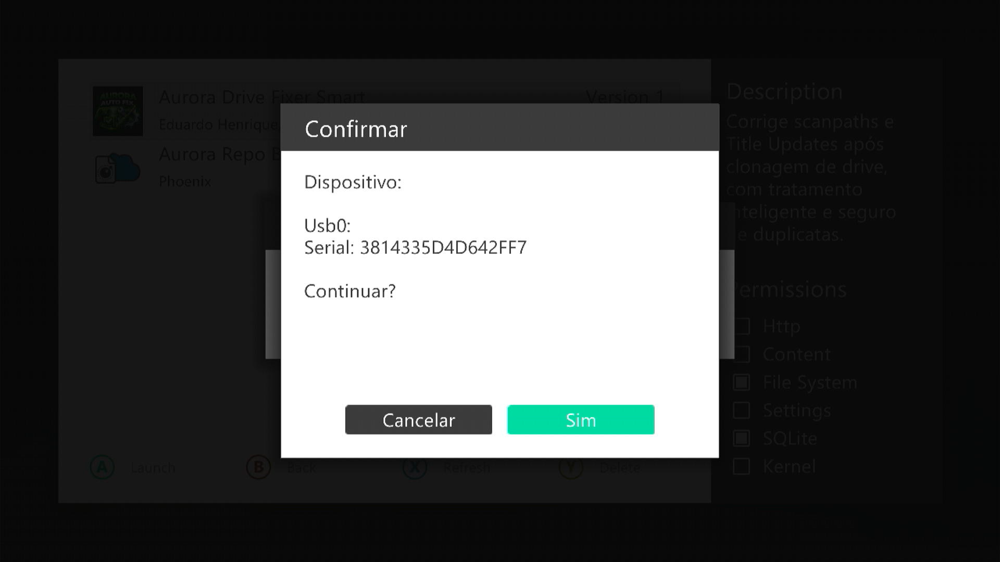
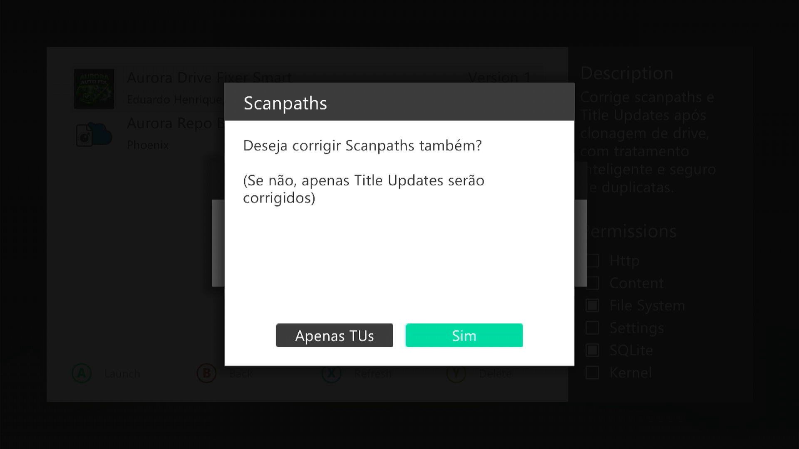
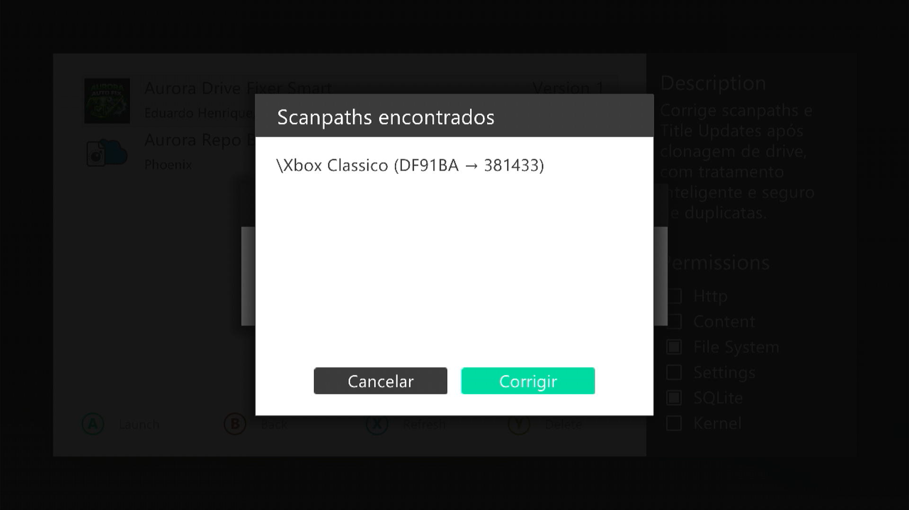
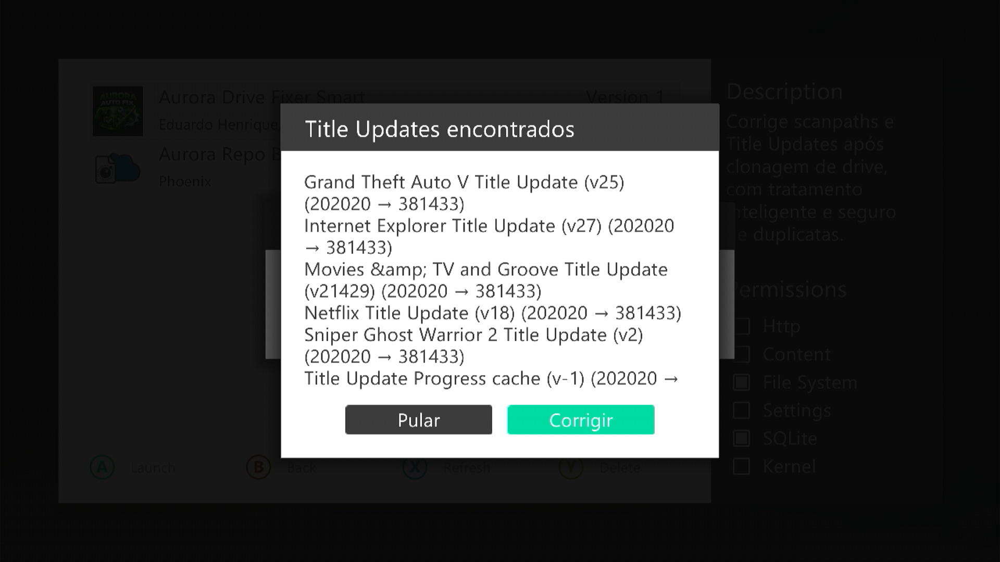
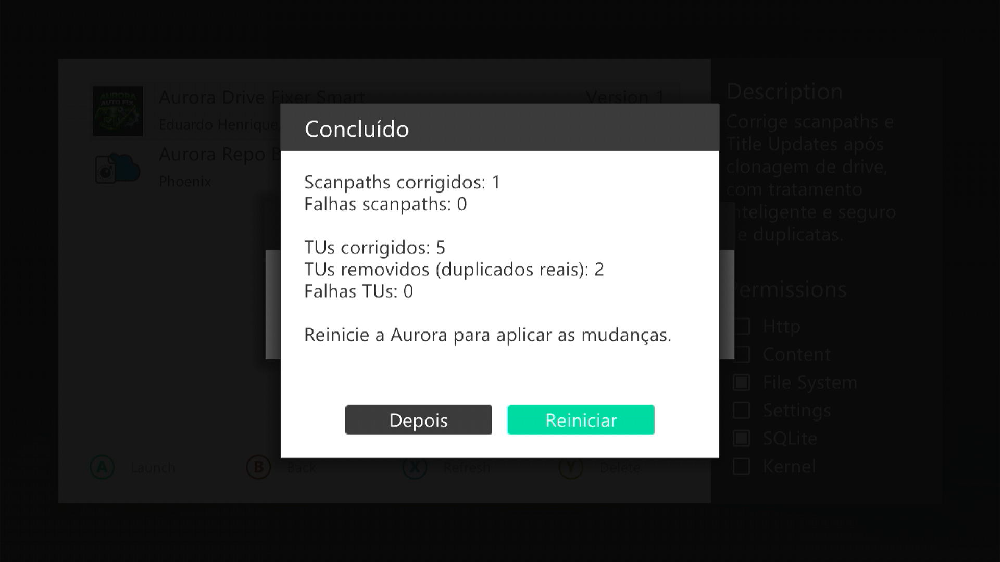
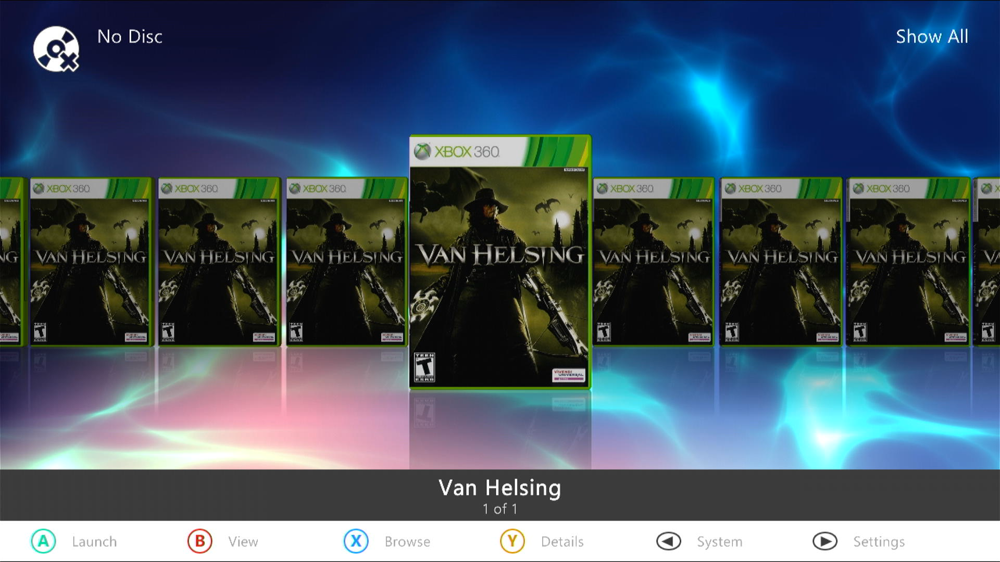

# 🚀 Aurora Drive Fixer Smart

A smart utility designed to fix common Aurora issues after replacing or cloning storage devices.

---

## 📌 About

**Aurora Drive Fixer Smart** was developed to automatically repair common issues caused by hard drive or USB cloning/replacement in Aurora, such as:

* Games not appearing in the library
* Grayed-out game covers
* Title Updates (TUs) no longer working

The tool safely updates Aurora's database by correcting internal references in a controlled manner.

---

## 🖼️ Preview

### Broken Scan Paths

<p align="center">
  
</p>

### Script Selection

<p align="center">
  
</p>

### Backup Warning

<p align="center">
  
</p>

### Drive Selection (Correct Serial Number)

<p align="center">
  
</p>

### Selected Drive Confirmation

<p align="center">
  
</p>

### Choose to Repair Scan Paths and/or Title Updates

<p align="center">
  
</p>

### Scan Paths Found

<p align="center">
  
</p>

### Title Updates Found

<p align="center">
  
</p>

### Final Results (Summary of Changes)

<p align="center">
  
</p>

### Scan Paths Successfully Repaired

<p align="center">
  
</p>

---

## 🧠 Key Features

* 🔧 Automatic **Scan Path** repair
* 🔄 Repairs **Title Update (TU)** associations
* 🧬 Detects and removes **true duplicate** Title Updates
* 🔍 Identifies storage devices by **serial number**
* 👁️ Preview changes before applying them
* 📊 Displays a final report including:

  * Repaired items
  * Errors (if any)
  * Removed duplicates

---

## 🛡️ Safety

* ✔️ No changes are made without user confirmation
* ✔️ Uses protected error handling (`pcall`) to prevent critical failures
* ✔️ Verifies data before applying modifications
* ⚠️ Clearly recommends creating a backup before running the script

> ⚠️ **Important:**
> This script **does not create backups automatically**.
> It is strongly recommended to manually back up Aurora's database before using it.

---

## 📦 When to Use

Use this tool in the following situations:

* 🔁 After **cloning a hard drive or USB storage device**
* 💾 After **replacing a storage device**
* 🎮 When **games no longer appear in Aurora**
* ⚙️ When **Title Updates are no longer applied**

---

## 📂 Backup (Recommended)

Before running the script, back up one of the following database files:

```text
Data\Databases\content.db
```

or

```text
User\Data\Databases\content.db
```

---

## ⚙️ How It Works

1. Select the correct storage device (identified by its serial number).
2. The script scans Aurora's database for inconsistencies.
3. A preview of the proposed changes is displayed.
4. Repairs are safely applied.
5. A final summary is shown.

---

## 🔄 Recommendation

After the script completes, **restart Aurora** to ensure all changes are properly applied.

---

## 🙏 Credits

This project was inspired by **Aurora Cloned Drive Fixer**, created by **EmiMods**.

Aurora Drive Fixer Smart expands upon the original concept by introducing:

* Greater automation
* Smarter database handling
* Intelligent duplicate detection and removal

🔗 Original project: https://github.com/EmiMods/FixClonedDrive

👤 Original author: EmiMods

---

## ⚠️ Disclaimer

Use this tool only when necessary.

Direct modifications to Aurora's database may cause inconsistencies if used improperly or outside of its intended purpose.

---

## 📌 Status

🟢 Stable — Ready for use.

---

## 💬 Contributing

Suggestions, improvements, bug reports, and feedback are always welcome!
